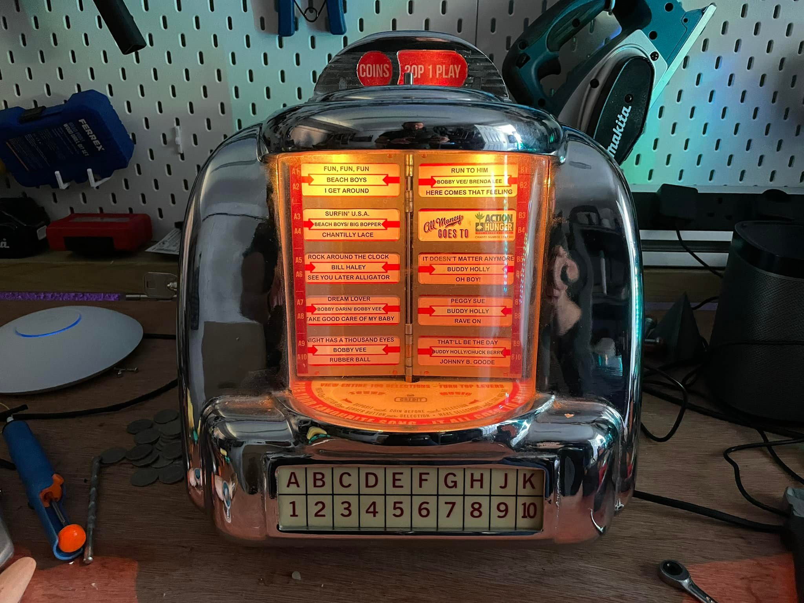
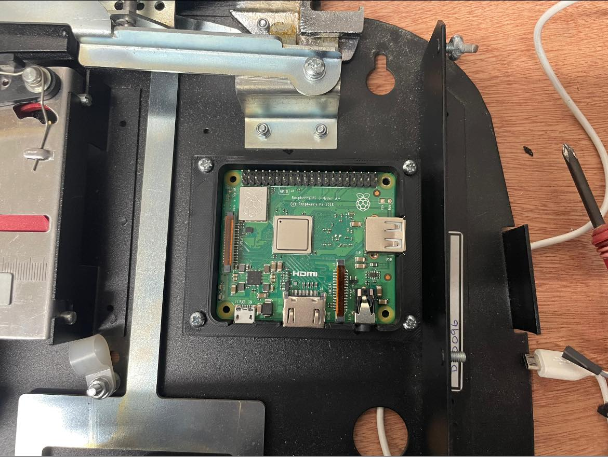
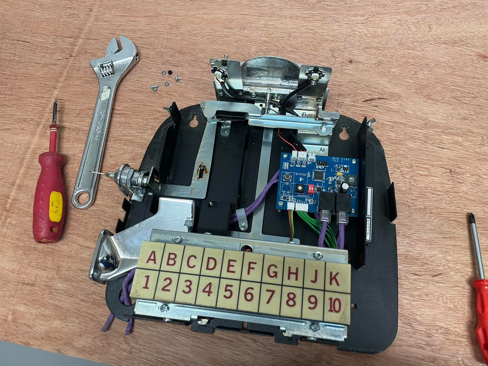
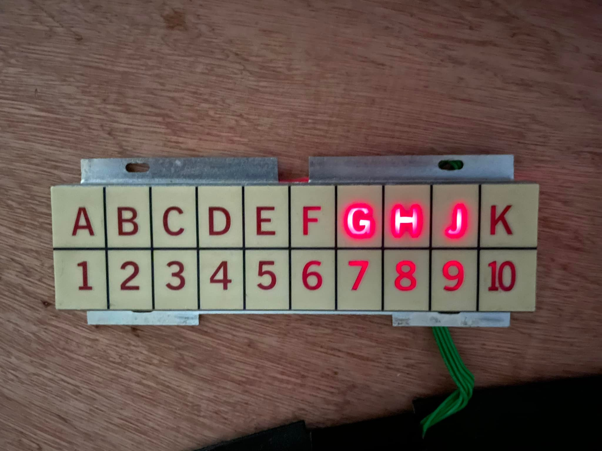

# dimepi

`dimepi` converts a Sound Leisure Dimebox into a Raspberry Pi powered Sonos jukebox.

In this conversion, the original Sound Leisure mainboard is removed and replaced with a Raspberry Pi Model A.

The project combines:

- A Python control process for keypad scanning, coin detection, credits, and Sonos queueing.
- A small FastAPI service for track database CRUD.
- A React admin frontend for managing the SQLite track database.
- Cabinet lighting driven by a single NeoPixel.

## Photos

### Demo Video

[](https://www.youtube.com/watch?v=6cHQMFh-Xqc)

### Completed Dimebox



The finished unit with the title card window illuminated and the original selection keypad retained.

## What The Hardware Does

The conversion keeps the original Sound Leisure Dimebox user interface hardware where possible, but replaces the original control board with a Raspberry Pi Model A.

Original Dimebox hardware retained:

- The keypad and illuminated selection buttons are handled through `3` x `MCP23017` I2C port expanders that are already part of the original Sound Leisure keypad assembly.
- The coin slot flag switch is read on a Raspberry Pi GPIO input.

Conversion hardware added:

- Cabinet lighting is driven by a single NeoPixel LED.
- Sonos playback is controlled through `docker-node-sonos-http-api`.

Mechanical parts included in this repo:

- [pi_carrier.stl](./pi_carrier.stl) provides a 3D printable carrier so the Raspberry Pi Model A can mount in the original mainboard location.

### Raspberry Pi Mounting



The printed carrier mounts the Raspberry Pi in the original mainboard location inside the Dimebox chassis.

The current software expects:

- `3` x `MCP23017` devices on the I2C bus at addresses `0x20`, `0x22`, and `0x25`
- Coin slot input on `GPIO4`
- NeoPixel data on `GPIO18`

## Raspberry Pi Pinout

The repo currently uses these Raspberry Pi signals:

| Function | BCM GPIO | Physical Pin | Notes |
| --- | --- | --- | --- |
| I2C SDA | `GPIO2` | Pin `3` | Shared by all `MCP23017` expanders |
| I2C SCL | `GPIO3` | Pin `5` | Shared by all `MCP23017` expanders |
| Coin slot flag switch input | `GPIO4` | Pin `7` | Configured as pull-up input in software |
| NeoPixel data | `GPIO18` | Pin `12` | Drives the cabinet light pixel |
| 3.3V | n/a | Pin `1` or `17` | Pi logic supply |
| 5V | n/a | Pin `2` or `4` | Typical NeoPixel supply rail |
| Ground | n/a | Pin `6` or others | Common ground for all devices |

## Keypad Hardware

The Sound Leisure Dimebox keypad already contains three `MCP23017` port expanders as part of the original hardware. This project reuses those existing expanders rather than adding new keypad interface boards.

During the conversion, the Raspberry Pi connects to those original keypad expanders over I2C.



Configured addresses in the code:

- Left keypad board: `0x25`
- Middle keypad board: `0x22`
- Right keypad board: `0x20`

The software uses the expanders for both:

- Button inputs
- Selection lamp outputs

### Keypad Illumination



The existing keypad lamps are driven through the original keypad electronics, which the Pi talks to over I2C.

Implementation reference:

- [keypad.py](/Users/paul/workspace/dimepi/keypad.py:1)

## Coin Slot Input

The coin mechanism uses a flag switch that can produce a noisy edge. The software applies debounce logic, but the hardware should also clean the signal before it reaches the Pi.

Recommended approach:

- Feed the coin slot flag switch through a `74HC14` Schmitt trigger before the Raspberry Pi GPIO input.
- Use the `74HC14` to square up the transition and reject slow or noisy switch edges.
- Keep a shared ground between the coin switch circuit, `74HC14`, and Raspberry Pi.

The software currently:

- Reads the coin signal on `GPIO4`
- Enables the Pi internal pull-up
- Triggers on the falling edge
- Applies a configurable debounce interval from `config.ini`

Implementation reference:

- [main.py](/Users/paul/workspace/dimepi/main.py:34)
- [config.ini](/Users/paul/workspace/dimepi/config.ini:1)

## Cabinet Lighting

Cabinet lighting is driven by a single NeoPixel using `GPIO18`.

Current behavior:

- Boot sets the pixel to the configured RGB color
- A scheduler turns the light on and off based on configured hours
- Color and schedule are persisted in the database

Implementation reference:

- [cabinet_lights.py](/Users/paul/workspace/dimepi/cabinet_lights.py:1)

## Software Layout

- `main.py`: main hardware controller, coin handling, keypad polling, Sonos queueing
- `api/`: FastAPI app exposing CRUD endpoints for tracks and cabinet light settings
- `frontend/`: React admin UI served by nginx
- `database.py`: SQLite access layer for tracks, credits, and lighting settings

## Docker Services

The Docker Compose stack includes four services:

- `dimepi`: main Raspberry Pi control process with GPIO and I2C access
- `dimepi-api`: FastAPI backend on port `8000`
- `dimepi-frontend`: React/nginx frontend on port `80`
- `sonos-api`: `docker-node-sonos-http-api` on port `5005`

Frontend and API behavior:

- The admin UI is available at `http://localhost`
- The frontend proxies `/api` requests to `dimepi-api`
- The API is also exposed directly at `http://localhost:8000`

## Running The Stack

Bring everything up with:

```sh
docker compose up --build
```

Open:

- Frontend: `http://localhost`
- API: `http://localhost:8000`

## Configuration

Runtime configuration lives in [config.ini](/Users/paul/workspace/dimepi/config.ini:1).

Important settings:

- `general.coinslot_gpio_pin`: coin input GPIO, currently `4`
- `general.cabinet_lights_colour`: default NeoPixel color as `R,G,B`
- `general.coin_debounce_time`: software debounce window in seconds
- `general.cabinet_lights_on_time`: daily lighting start time
- `general.cabinet_lights_off_time`: daily lighting end time
- `sonos.api_url`: Sonos HTTP API endpoint
- `sonos.zone`: Sonos zone name
- `sonos.queuemode`: playback queue mode
- `sonos.queueclear`: whether to clear the queue when appropriate

## Notes

- The main controller uses Raspberry Pi specific GPIO libraries and is intended to run on actual Pi hardware.
- The `dimepi` service runs privileged and uses host networking because it needs direct hardware access.
- If the coin input is unreliable, fix the hardware edge quality first with the `74HC14`, then tune the software debounce value.
